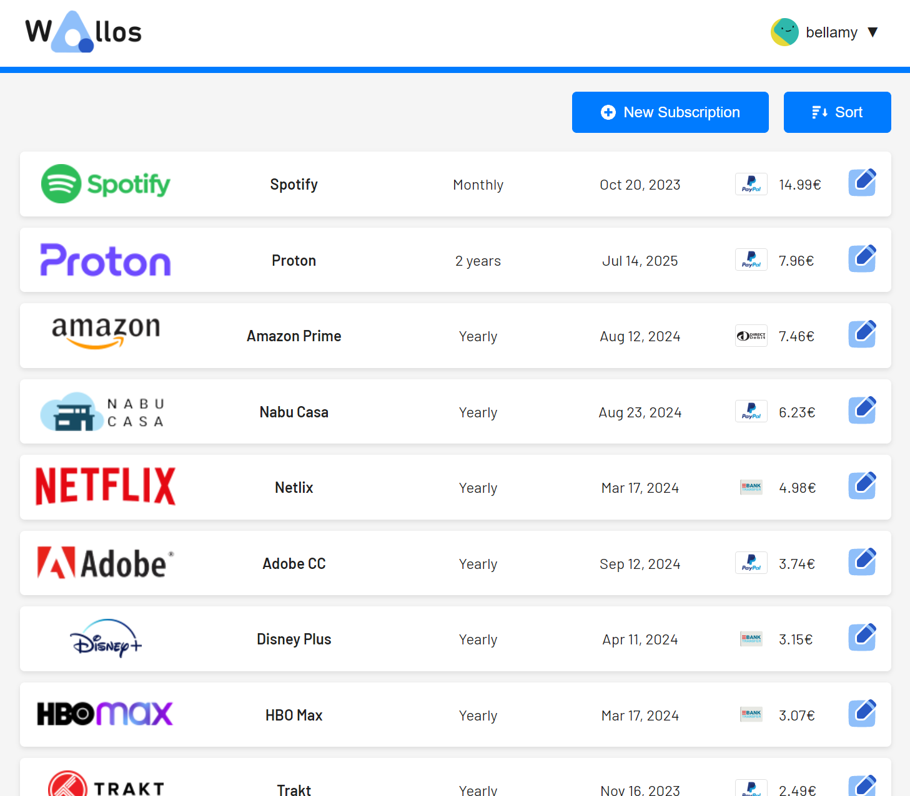
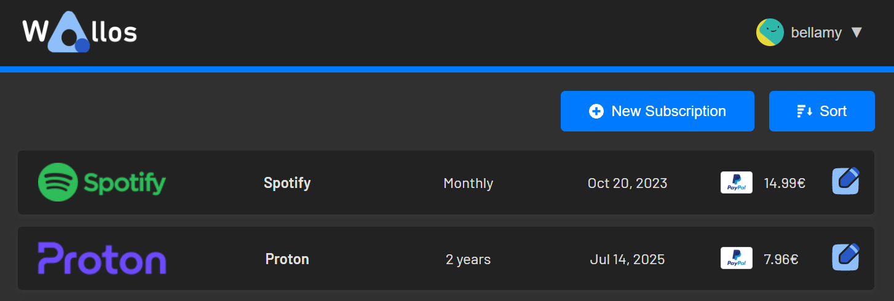
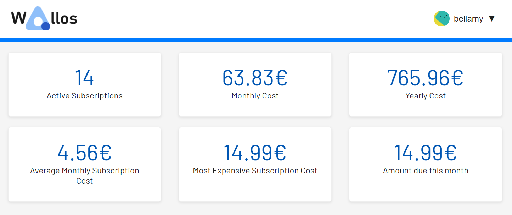
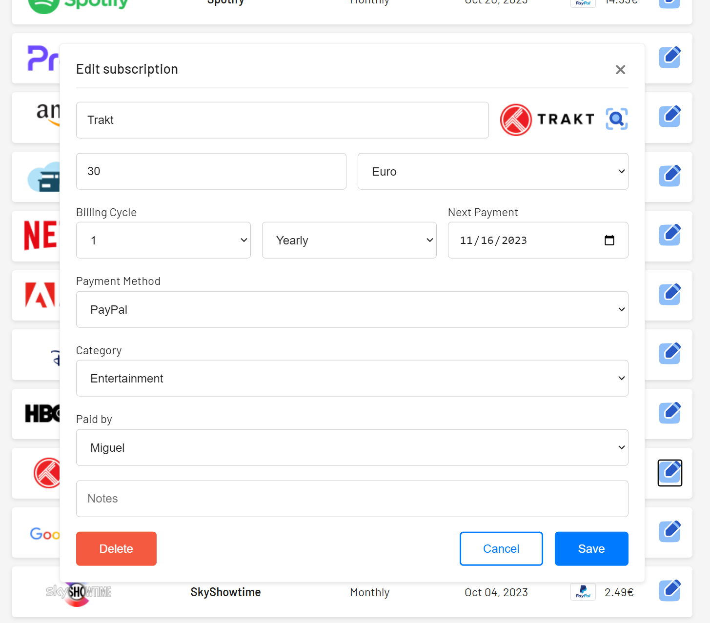
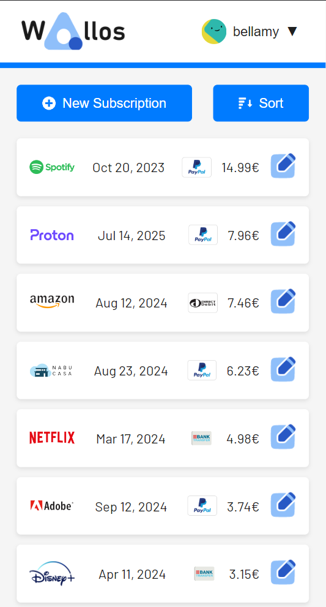
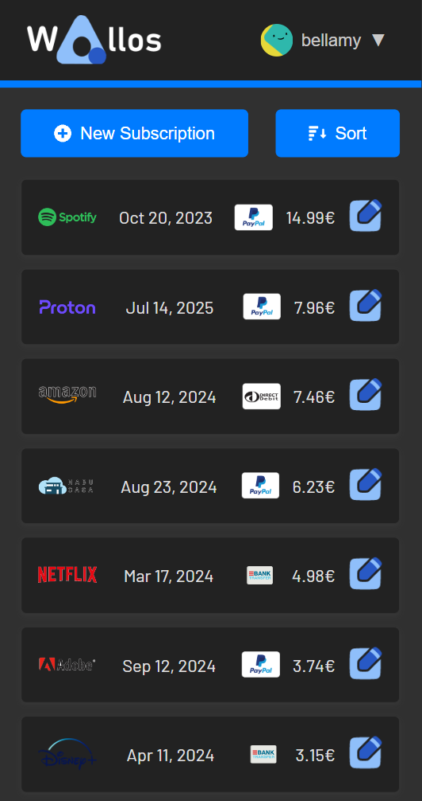

# WALLOS

Wallos: Open-Source Personal Subscription Tracker

## Table of Contents

- [Introduction](#introduction)
- [Features](#features)
- [Getting Started](#getting-started)
  - [Prerequisites](#prerequisites)
    - [Baremetal](#baremetal)
    - [Docker](#docker)
  - [Installation](#installation)
    - [Baremetal](#baremetal-1)
    - [Docker](#docker-1)
- [Usage](#usage)
- [Contributing](#contributing)
- [Screenshots](#screenshots)
- [License](#license)

## Introduction

Wallos is a powerful, open-source, and self-hostable web application designed to empower you in managing your finances with ease. Say goodbye to complicated spreadsheets and expensive financial software – Wallos simplifies the process of tracking expenses and helps you gain better control over your financial life.

## Features

- Subscription Management: Keep track of your recurring subscriptions and payments, ensuring you never miss a due date.
- Category Management: Organize your expenses into customizable categories, enabling you to gain insights into your spending habits.
- Multi-Currency support: Wallos supports multiple currencies, allowing you to manage your finances in the currency of your choice.
- Currency Conversion: Integrates with the Fixer API so you can get exchange rates and see all your subscriptions on your main currency.
- Data Privacy: As a self-hosted application, Wallos ensures that your financial data remains private and secure on your own server.
- Customization: Tailor Wallos to your needs with customizable categories, currencies, themes and other display options.
- Sorting Options: Allowing you to view your subscriptions from different perspectives.
- Logo Search: Wallos can search the web for the logo of your subscriptions if you don't have them available for upload.
- Mobile view: Wallos on the go.
- Statistics: Another perspective into your spendings.

## Getting Started

See instructions to run Wallos below.

### Prerequisites

#### Baremetal

- NGINX or APACHE websever running
- PHP 7.4 or 8.0 with the following modules enabled:
    - curl
    - gd
    - imagick
    - sqlite3

#### Docker

- Docker

### Installation

#### Baremetal

Download or clone this repo and move the files into your web root - usually `/var/www/html`

Add the following scripts to your cronjobs with `crontab -e`

```bash
0 0 * * * php /var/www/html/endpoints/cronjobs/updatenextpayment.php >> /var/log/cron/updatenextpayment.log 2>&1
0 1 * * * php /var/www/html/endpoints/cronjobs/updateexchange.php >> /var/log/cron/updateexchange.log 2>&1
```

#### Docker

```bash
docker run -d --name wallos -v /path/to/config/wallos/db:/var/www/html/db \
-v /path/to/config/wallos/logos:/var/www/html/images/uploads/logos \
-e TZ=Europe/Berlin -p 8282:80 --restart unless-stopped \ 
bellamy/wallos:latest
```

## Usage

Just open the browser and open `ip:port` of the machine running wallos.
On the first time you run wallos a user account must be created.
Go to settings and add personalise your Avatar and add members of your household. While there add / remove any categories and currencies.
Get a free API Key from [Fixer](https://fixer.io/#pricing_plan) and add it in the settings.
If you want to trigger an Update of the exchange rates, change your main currency after adding the API Key, and then change it back to your prefered one.

## Screenshots













## Contributing

Feel free to open Pull requests with bug fixes and features. I'll do my best to keep an eye on those.
Feel free to open issues with bug reports or feature requests. Bug fixes will take priority.
I welcome contributions from the community and look forward to working with you to improve this project.

## License

This project is licensed under the [GNU General Public License, Version 3](LICENSE.md) - see the [LICENSE.md](LICENSE.md) file for details.

### Why GPLv3?

I chose the GNU General Public License version 3 (GPLv3) for this project because it ensures that the software remains open source and freely available to the community. GPLv3 mandates that any derivative works or modifications must also be released under the same license, promoting the principles of software freedom.

I strongly believe in the importance of open source software and the collaborative nature of development, and I invite contributors to help improve this project.